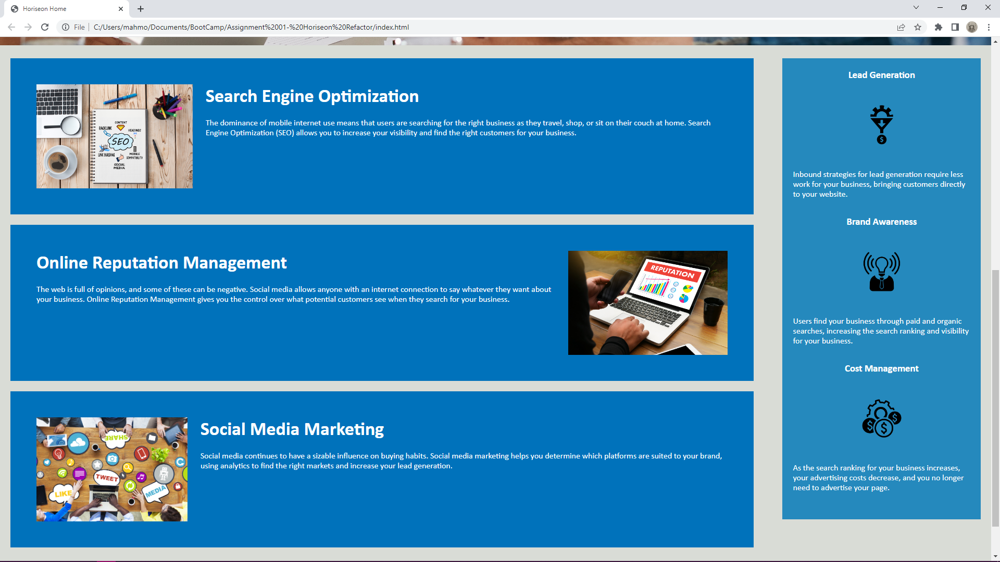

# Code Refactor for Horiseon

## Description
I refactored the html code of Horiseons codebase and rearranged the css code to be more organised. I also had to change some of the css code to accommodate for the new changes in html all in hopes of improving the search engine optimisation of the codebase and making it follow accessibilty standards. After rearranging the css code I also added comments to make the elements more identifiable 

## Screenshots

## Link to Deployed application

